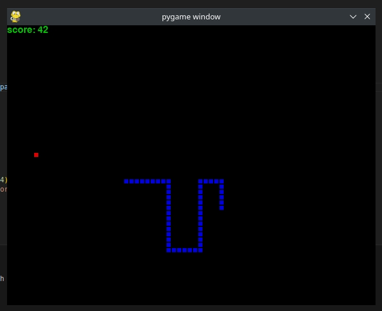

# pygame-snake
Snake written using Pygame.

←  ↑  →  ↓



## Installing and Using (Linux)
```sh
# create Python Virtual environment
python3 -m venv .venv
# activate it
source .venv/bin/activate
# update pip
pip install -U pip
# install requirements (pygame)
pip install -r requirements.txt

# execute
./src/main.py
```
